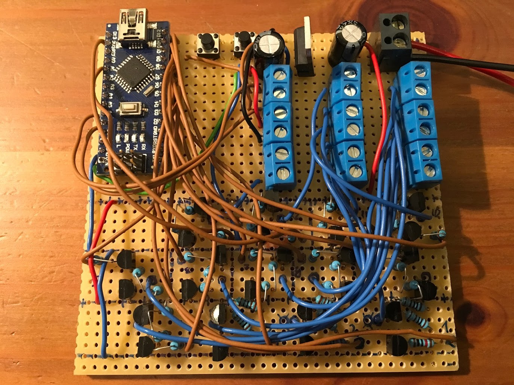
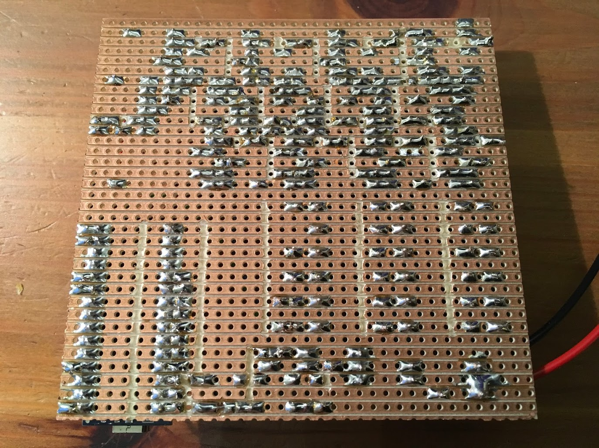
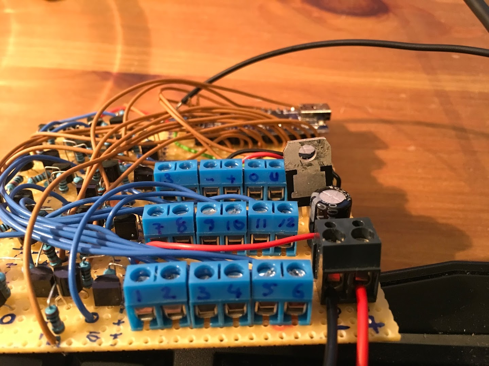
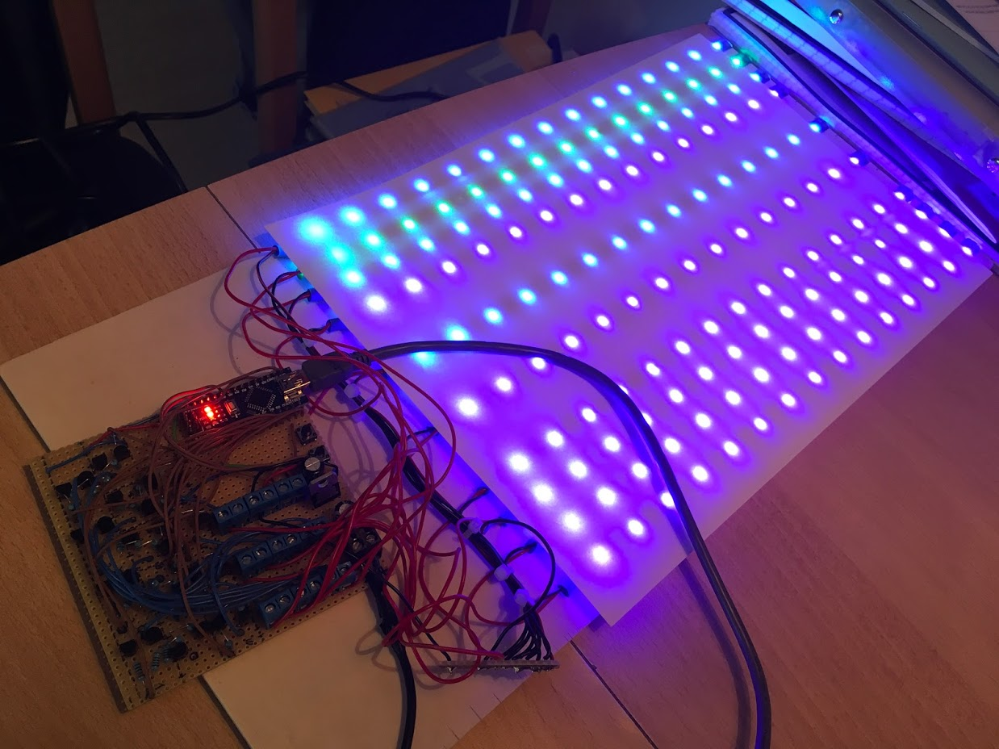

# Junior-Stair-Light-Project

This is a stair light project, based on arduino. Low cost, low effort, still some fun walking up or down the stairs.

I created this for a friend. For several reasons, we connected ground of all LED strips together and led all the positive leads to the circuit for switching/PWM. Because of that, we had to use that dual-transistor circuit, which I found on the internet, to be able to switch the positive lines.
It is actually easier to switch the negative lines, that just requires one transistor/MOSFET, so if you do this you should probably go with that approach.

Nothing more to add really, just read the circuit under schematics/kicad (there is a PDF) and you should be good.

# Needed Materials:

- Power supply, 12V DC, 2A should be enough (I found a 3A in my mess)
- 1 x Arduino Nano
- 2 x 10k resistors
- 1 x 5V regulator (L4940V5)
- 2 x 100uF electrolytic capacitor
- 1 x 100nF ceramic capacitor

Then per step you need:
- 1 x LED stripe (12V, for cars)
- 2 x 1kOhm resistor
- 1 x 10kOhm resistor
- 1 x BC337 (or similar) NPN Transistor
- 1 x BC327 (or similar) PNP Transistor

Additionally you need a prototype board for soldering components, some wires for connecting the components, tools (soldering iron, solder, cutter, clippers, a Dremel helps to cut the copper on the board) and some time and patience.

# Printed Circuit Board
I have created a first Release Candidate (RC) of a printed circuit board. I added the maximum number of channels (steps) that an Arduino Nano can have, which is number of Digital outputs + number of Analog outputs - 2 analog outputs (for the IR sensors), which should end up at 19.
So, 19 is the maximum number of steps your stairs can have, using this single Arduino Nano module.
To order the PCB you'll need to send the Gerber files to a PCB manufacturer of your choice. The Gerber files are in the ZIP archive here: [Gerber zip archive](schematics/kicad/GERBERS).
As of today, I haven't order a set, so I cannot say whether this is working. Try at your own risk!

# Steps:
1. buy all the material
2. create the board (see pictures), start with one channel first
3. test that first channel
4. create all the channels
5. stick it to your stairs

I'll create a PCB, so if you want you can order it from your favourite PCB shop, should be cheap as well and save a lot of time. It is not easy to prototype this stuff, depends on you.

# Pictures

This is the finished board, top view.

This is the finished board, bottom view.

These are the connectors for the LED strips, power and IR sensors

The test setup for finishing the code.
I did not have enough left over stripes, hence there are some missing here, but that is sufficient.

This can probably be done on one weekend.
