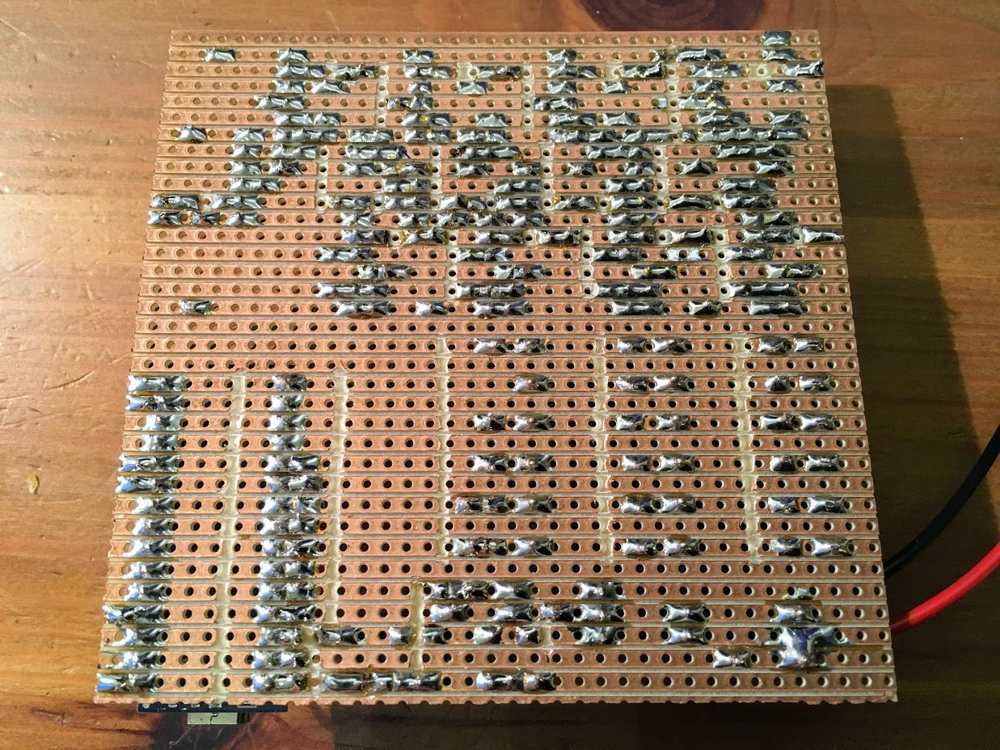
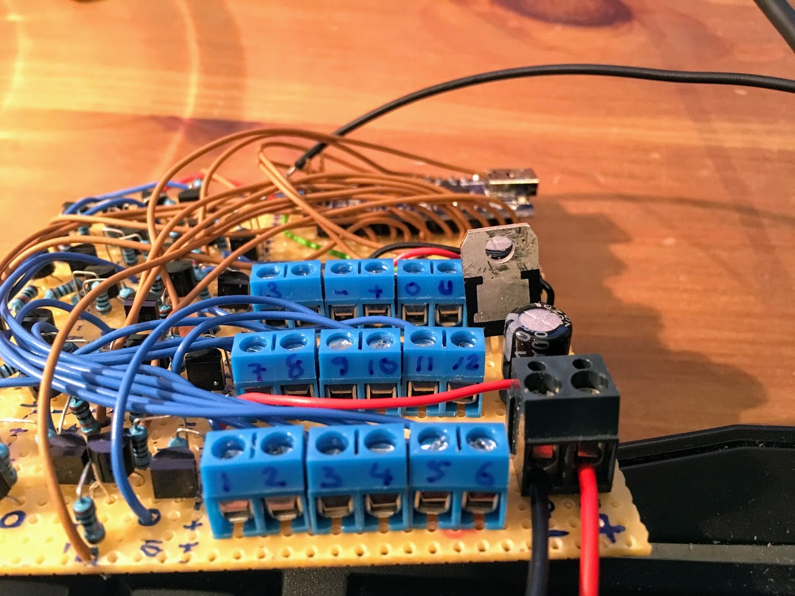

# Junior-Stair-Light-Project

This is a smaller/easier/cheaper version of my NexPixel Stair Light Project. The basic idea is to use a bunch of cheap 12V LEDs stripes, two sensors and an Arduino Nano and animate those LED stripes if a person is walking up or down the stairs.

I created this for a friend of mine. He went out on the internet and bought sets of LED stripes (originally thought for cars, 12V) and mounted them under the stairs. I then went ahead and created this little project around it, giving it some more fun.

For several reasons, all grounds of the LED stripes were connected together and all the positive leads were routed to the circuit for switching/PWM. Because of that, I had to use that dual-transistor circuit, which I found on the internet, to be able to switch the positive lines.
It is actually easier to switch the negative lines, that just requires one transistor/MOSFET, so if you do this and you have a choice, you should probably go with that approach.

Nothing more to add really, just read the circuit under schematics/kicad (there is a PDF) and you should be good.

# Needed Materials:

- Power supply, 12V DC, 2A should be enough (I found a 3A in my mess)
- 1 x Arduino Nano
- 2 x 10k resistors (optional, pull up for PIR sensors, I did not need to use them)
- 1 x 5V regulator (L4940V5)
- 2 x 100uF electrolytic capacitor
- 1 x 100nF ceramic capacitor
- a project box to house the electronics

Then _per step_ you need:
- 1 x LED stripe (12V, for cars)
- 2 x 1kOhm resistor
- 1 x 10kOhm resistor
- 1 x BC337 (or similar) NPN Transistor
- 1 x BC327 (or similar) PNP Transistor

Additionally you need a prototype board (or the PCB, see below) for soldering components, some wires for connecting the components, tools (soldering iron, solder, cutter, clippers, a Dremel helps to cut the copper on the board) and some time and patience.

# Printed Circuit Board
I have created a first "Release Candidate" (RC) of a printed circuit board for this project. I added the maximum number of channels (steps) that an Arduino Nano can have, which is number of Digital outputs + number of Analog outputs - 2 analog outputs (for the IR sensors), which should end up at 18.

So, 18 is the maximum number of steps your stairs can have using this single Arduino Nano module. If you have less stairs, just populate the board with the appropriate number of parts for the channels. If you have more stairs - well, you are on your own.

To order the PCB you'll need to send/upload the Gerber files to a PCB manufacturer of your choice. You can find the Gerber files here: [Gerber zip archive](schematics/kicad/GERBERS), just use the ZIP archive. The board is 9cm x 9cm, currently you get special offers for 2$ for 10 pieces - ridicolous!

As of today (Sep 2018), I have not yet ordered a PCB, so I cannot say whether this PCB is really working, it might still be full of bugs! Try at your own risk!

# Steps:
1. buy all the material
2. create the board (see pictures), start with one channel first
3. test that first channel
4. create all the channels
5. stick it to your stairs

# Pictures

This is the finished board, top view.

This is the finished board on a prototype PCB, bottom view.

These are the connectors for the LED strips, power and IR sensors

The test setup for finishing the code.
I did not have enough left over stripes, hence there are some missing here, but that is sufficient.

This can probably be done on one weekend if you are somewhat experienced.
